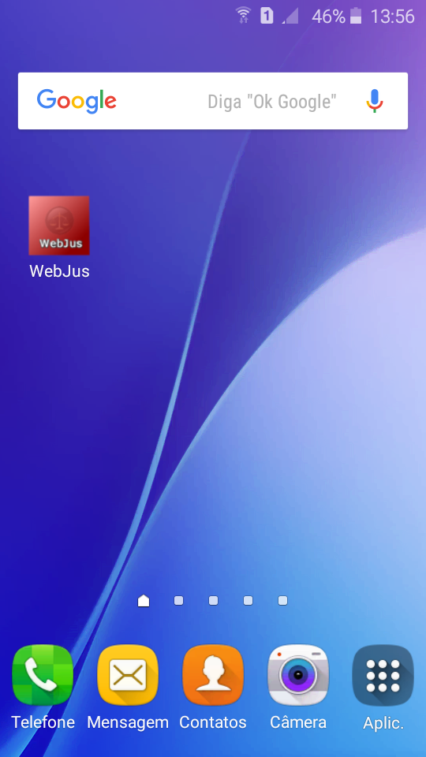

## LINGUAGEM E IDE

Framework: Cordova e IONIC
HTML 5, CSS, JAVASCRIPT
IDE: Visual Studio Code / SublimeText 3

## AUTOR

Autor: Eduardo Camargo
E-mail: educamargomt@gmail.com

Esse projeto faz parte do curso de
Desenvolvimento Mobile.

Apenas como TESTE.

## RESUMO
Desenvolvimento de um sistema da área jurídcia,
que disponibiliza notícias diárias do STF,
Constituição para Consulta e Informações para Realizar 
denúncias

## IMAGEM EXEMPLO - ATUALIZAÇÃO

-Última atuazação, criação de ícone e alteração visual.

-Visualização da logo

 

 

 

-Processo de Criação da Logo, usando Fireworks CS6

 

 

 

 

 

 

 

 
